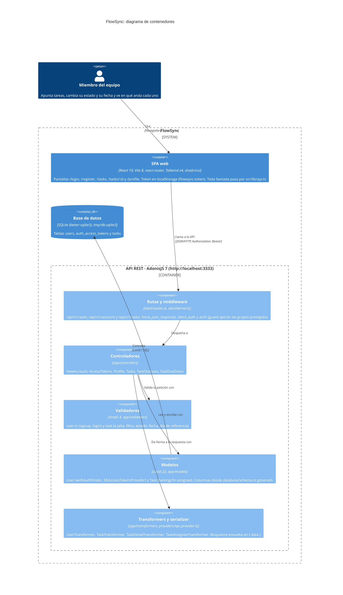

# Arquitectura de FlowSync

Diagrama de contenedores al estilo C4 de FlowSync, sacado únicamente de lo que hay en el código. FlowSync tiene tres contenedores:

- **La SPA de React:** `frontend/`. Guarda el token en `localStorage` bajo `flowsync.token` y hace todas sus llamadas desde `src/lib/api.ts`.
- **La API de AdonisJS:** `backend/`. Expone las rutas `/api/v1/*` de `start/routes.ts`.
- **El fichero SQLite:** `tmp/db.sqlite3`, al que se llega por Lucid con `better-sqlite3`.

Dentro de la API se ve, además, por qué capas pasa una petición: middleware de auth, controladores, validadores de VineJS, modelos de Lucid y transformers. El serializer de `providers/api_provider.ts` envuelve cada respuesta en `{ data }`. No aparece ningún sistema externo, porque el código no llama a ninguno.

